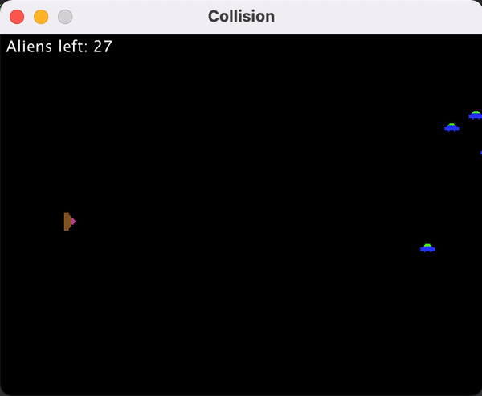

# Collision Detection with Mouse
### Penjelasan Program
Jadi, perubahan dari program sebelumnya yaitu :
* Mengganti kontrol perpindahan spaceship dengan mouse
* Menambahkan kontrol klik mouse untuk mengeluarkan Missile dari spaceship

Perubahan dilakukan dengan cara menambahkan kelas MAdapter pada class Board untuk menjadi mouse Listener:
```
private class MAdapter extends MouseAdapter{
		 
		 public void mouseEntered (MouseEvent e) {
			 BufferedImage cursorImg = new BufferedImage(16, 16, BufferedImage.TYPE_INT_ARGB);
			 Cursor blankCursor = Toolkit.getDefaultToolkit().createCustomCursor(
					    cursorImg, new Point(0, 0), "blank cursor");
			 setCursor(blankCursor);
		 }
		
		 public void mouseClicked(MouseEvent e) {
			 spaceship.mouseclicked(e);
		 }
		 
		 public void mouseMoved(MouseEvent e) {
			 spaceship.mousemoved(e);
		 }
		 
		 public void mouseDragged(MouseEvent e) {
			 spaceship.mousemoved(e);
			 spaceship.mouseclicked(e);
		 }		 
	 }
```

Untuk perubahan posisi spaceship pada class SpaceShip diubah menjadi:
```
 public void mousemoved(MouseEvent e) {
    	 
    	 dx = e.getX();
    	 dy = e.getY();
     }
```
Sehingga posisi dari spaceship dapat sesuai dengan posisi dari kursor yaitu pada koordinat X dan Y.

Untuk menambah kontrol klik mouse untuk mengeluarkan missile ditambahkan fungsi pada class SpaceShip sebagai berikut:
```
public void mouseclicked(MouseEvent e) {
    	 fire();
     }
```
Dengan penambahan ini, penembakan missile dapat dilakukan dengan klik mouse dan spasi.
### Screenshot Class Diagram


### Screenshot Jalannya Program



[Video Youtube](https://youtu.be/O2gdWjSXlSg)
