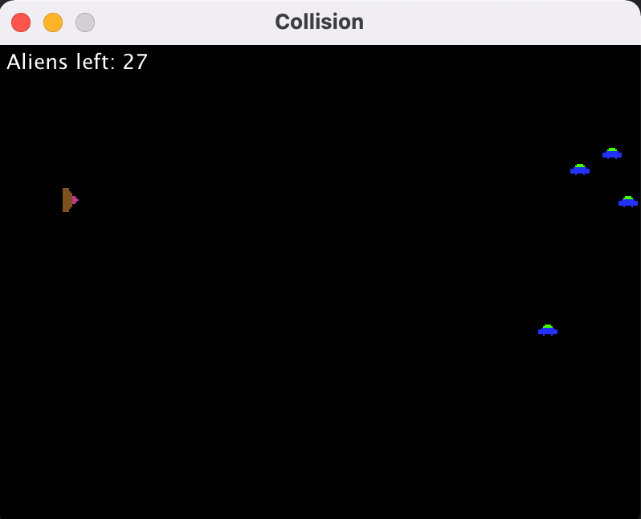

# Collision Detection
### Penjelasan Program
Collision Detection merupakan program berbasis GUI (Graphic User Interface) yang berisikan program untuk mendeteksi adanya tabrakan antara 2 objek. Program ini diimplementasikan seperti sebuah game. Dalam program ini terdapat beberapa objek sebagai berikut:
* SpaceShip <br>
  Spaceship (kapal luar angkasa) akan bergerak vertikal dan horizontal sesuai arah user melalui keyboard, program akan berakhir jika spaceship mengenai alien.
* Missile <br>
  Missile akan keluar dari spaceship jika user menekan "space" dan bergerak secara horizontal ke kanan, missile akan hancur jika mengenai alien.
* Aliens <br>
  Alien ditempatkan dikoordinat yang sudah ditentukan dalam program, alien akan hancur jika mengenai missile.

### Class dalam program
#### Sprite.java
Class ini merupakan parent dari Class Alien, SpaceShip, dan Missile.
Dalam Class ini terdapat properti sebagai berikut:
* `x` - x koordinat objek
* `y` - y koordinat objek
* `width` - ukuran lebar objek
* `height` - ukuran panjang objek
* `visible` - boolean yang menunjukkan keberadaan objek
* `image` - image dari objek 

Dalam Class ini terdapat method sebagai berikut:
* `Sprite(x, y)` -  constructor class Sprite dengan x dan y sebagai posisi awal
* `getImageDimensions()` - mendapatkan ukuran gambar.
* `loadImage()` - memuat gambar
* `getX()` - mendapatkan nilai variabel x
* `getY()` - mendapatkan nilai variabel y
* `isVisible()` - mengakses variabel boolean visible
* `setVisible(visible)` - merubah nilai varibel boolean visible
* `getImage()` - mendapatkan gambar objek
* `getBounds()` - mendapatkan batas kotak gambar

#### Board.java
Class ini dipanggil pada class CollisionEx:
```
add(new Board());
```
Dalam Class ini terdapat properti sebagai berikut:
* `timer` - set waktu untuk objek board
* `spaceship`- objek Spaceship
* `aliens` - list alien untuk ditampilkan
* `ingame` - boolean yang menunjukkan jalannya program
* `ICRAFT_X` - x koordinat posisi awal spaceship
* `ICRAFT_Y` - y koordinat posisi awal spaceship
* `B_WIDTH` - ukuran lebar board
* `B_HEIGHT` - ukuran panjang board
* `DELAY` - delay inisialisi timer (ms)
* `pos` - array posisi semua alien

Dalam Class ini terdapat method sebagai berikut:
* `Board()` - constructor pada class board
* `initBoard()` - inisialisasi board
* `initAliens()` - inisialisasi alien
* `paintComponent(Graphics g)` - mencetak komponen dalam board
* `drawObjects(Graphics g)`- mencetak komponen jika program berlangsung
* `drawGameOver(Graphics g)` - mencetak komponen jika program berhenti
* `actionPerformed(ActionEvent e)` - menjalankan program
* `inGame()` - menghentikan timer jika program berhenti
* `updateShip()` - mengupdate posisi spaceship
* `updateMissiles()` - mengupdate posisi missile
* `updateAliens()` - mengupdate posisi alien
* `checkCollisions()` - memeriksa adanya tabrakan 

#### SpaceShip.java
Class ini dipanggil pada class Board:
```
spaceship = new SpaceShip(ICRAFT_X, ICRAFT_Y);
```
Dalam Class ini terdapat properti sebagai berikut:
* `dx` - perpindahan horizontal posisi spaceship 
* `dy`- perpindahan vertikal posisi spaceship
* `missiles` - list missile yang akan ditampilkan

Dalam Class ini terdapat method sebagai berikut:
* `Spaceship(x,y)` - constructor class SpaceShip dengan x dan y sebagai posisi awal
* `initCraft()` - inisialisasi spaceship dengan list Missile
* `move()` - mengatur perpindahan spaceship
* `getMissiles()` - mendapatkan list Missile
* `KeyPressed(KeyEvent e)` - mengatur perintah sesuai keyboard yang ditekan
* `fire()` - mengeluarkan missile
* `KeyReleased()` - validasi keyboard yang akan ditekan

#### Alien.java
Class ini dipanggil pada class Board:
```
aliens = new ArrayList<>();

	        for (int[] p : pos) {
	            aliens.add(new Alien(p[0], p[1]));
	           // System.out.println(p[0] + p[1]);
	        }
```
Dalam Class ini terdapat properti sebagai berikut:
* `INITIAL_X` - posisi x alien setelah x < 0

Dalam Class ini terdapat method sebagai berikut:
* `Alien(x, y)` -  constructor class Alien dengan x dan y sebagai posisi awal
* `initAlien()` - inisialisasi alien
* `move()` - mengatur perpindahan alien

#### Missile.java
Class ini dipanggil pada class SpaceShip:
```
public void fire() {
          missiles.add(new Missile(x + width, y + height / 2));
     }
```
Dalam Class ini terdapat properti sebagai berikut:
* `BOARD_WIDTH` - batas horizontal keberadaan objek missile
* `MISSILE_SPEED` - perpindahan missile

Dalam Class ini terdapat method sebagai berikut:
* `Missile(x, y)` -  constructor class Missile dengan x dan y sebagai posisi awal
* `initMissile()` - inisialisasi missile
* `move()` - mengatur perpindahan missile

#### CollisionEx.java
main Class untuk menjalankan program. Dalam class ini terdapat method inisialisasi User Interface sebagai berikut:
```
 private void initUI() {
        
        add(new Board());
        
        setResizable(false);
        pack();
        
        setTitle("Collision");
        setLocationRelativeTo(null);
        setDefaultCloseOperation(JFrame.EXIT_ON_CLOSE);
    }
```
### Screenshot Class Diagram

### Screenshot Jalannya Program

