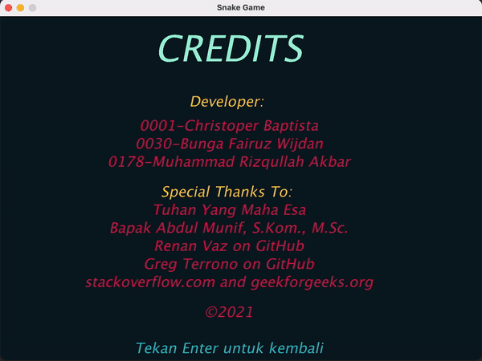

# Final Project
## Snake
Snake adalah sebuah video game klasik yang sudah cukup lama dikenal. Game ini dibuat pada akhir tahun 70an. Dalam game ini, pemain mengontrol seekor ular. Tujuannya adalah memakan ceri sebanyak mungkin. Setiap kali ular memakan ceri, maka tubuhnya akan tumbuh. Ular harus menghindari tembok dan tubuhnya sendiri.
## Penjelasan Program
### Game ini memiliki 2 objek utama, yaitu:
* Snake
* Cherry

### Pada program snake ini memiliki beberapa class:
#### Main
Pada class ini berfungsi untuk menginisialisasi frame untuk program. Class ini juga memiliki fungsi main yaitu fungsi utama saat program dijalankan.
#### Snake
Pada class ini berfungsi untuk menyimpan berapa panjang Snake pada Array Dinamis, serta arah yang sedang dituju oleh snake.
#### Point
Pada class ini berfungsi untuk memposisikan Snake dan Cherry, serta untuk mengecek saat Snake memakan Cherry.
#### HighScore
Pada claas ini berfungsi untuk sistem score tertinggi, Serta juga menyimpan 10 score tertinggi menggunakan `Serializable`.
#### Game
Pada class ini merupakan class terkompleks dengan banyak fungsi. Mulai dari rendering `graphics2d` dari setiap halaman di program, alur jalannya program, update untuk ukuran Snake, Score, serta Cherry pada posisi random.
#### KeyListener
Pada class ini berfungsi untuk mendeteksi adanya input dari keyboard, dan menentukan apa yang dilakukan saat key tertentu ditekan.
#### GameLoop
Pada class ini berfungsi melakukan pengulangan program sesuai alur, hingga user menutup window.
### Pada program ini juga memiliki beberapa enum:
* Direction
* GameStatus

### Screenshot Jalannya Program

[Video Youtube](https://youtu.be/wpvXzk0td7U)

### Link Referensi
[HighScore](https://github.com/gterrono/tetris/tree/master/src)

[Snake](http://zetcode.com/javagames/snake/)
